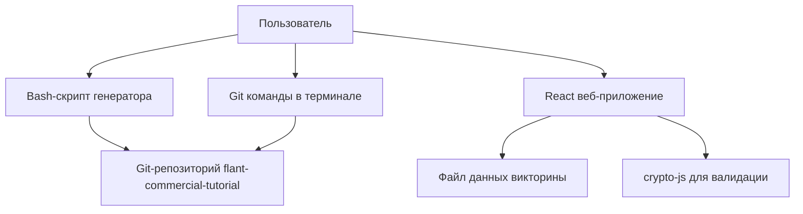
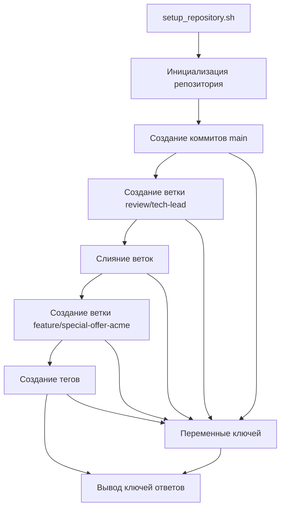
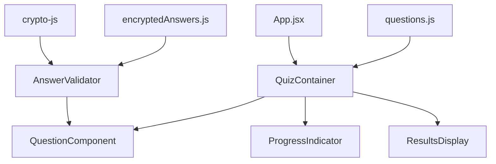

# Документ дизайна

## Обзор

Система "Управляем КП" представляет собой двухкомпонентное решение для обучения Git:

1. **Генератор сценария** - bash-скрипт, создающий Git-репозиторий с предопределенной историей коммитов, веток и тегов
2. **Интерактивная викторина** - веб-приложение на React с Bun runtime для проверки знаний Git

Система имитирует реальный рабочий процесс разработки коммерческого предложения в компании "Флант", включая типичные Git-операции: создание веток, слияние, исправление ошибок, тегирование релизов.

## Архитектура

### Высокоуровневая архитектура



### Архитектура генератора сценария



### Архитектура веб-приложения



## Компоненты и интерфейсы

### 1. Генератор сценария (setup_repository.sh)

**Назначение:** Создание Git-репозитория с предопределенной историей для обучения

**Основные функции:**

- `cleanup_existing()` - удаление существующего репозитория
- `init_repository()` - инициализация нового репозитория
- `create_main_commits()` - создание коммитов в основной ветке
- `create_review_branch()` - создание и работа с веткой ревью
- `create_feature_branch()` - создание ветки для специального предложения
- `create_tags()` - создание тегов для релизов
- `capture_keys()` - захват ключей ответов в переменные
- `display_results()` - вывод всех ключей для проверки

**Выходные данные:**

```bash
# Структура переменных ключей
TASK1_ANSWER="<hash_первого_коммита>"
TASK2_ANSWER="прозрачность"
TASK3_ANSWER="review/tech-lead"
TASK4_ANSWER="notes.txt"
TASK5_ANSWER="18%"
TASK6_ANSWER="git diff HEAD~1 HEAD"
TASK7_ANSWER="<hash_коммита_скидки>"
TASK8_ANSWER="v1.0-sent"
TASK9_ANSWER="<количество_коммитов>"
```

### 2. Веб-приложение викторины

#### 2.1 Структура проекта

```
git-trainer-quiz/
├── package.json
├── bun.lockb
├── src/
│   ├── App.jsx
│   ├── components/
│   │   ├── QuizContainer.jsx
│   │   ├── QuestionComponent.jsx
│   │   ├── ProgressIndicator.jsx
│   │   └── ResultsDisplay.jsx
│   ├── data/
│   │   ├── questions.js
│   │   └── encryptedAnswers.js
│   ├── utils/
│   │   └── answerValidator.js
│   └── styles/
│       └── main.css
└── public/
    └── index.html
```

#### 2.2 Основные компоненты

**App.jsx**

- Корневой компонент приложения
- Управление общим состоянием викторины
- Роутинг между вопросами

**QuizContainer.jsx**

- Контейнер для логики викторины
- Управление текущим вопросом
- Отслеживание прогресса
- Обработка отправки ответов

**QuestionComponent.jsx**

- Отображение отдельного вопроса
- Поле ввода ответа
- Кнопка отправки
- Отображение подсказок

**ProgressIndicator.jsx**

- Индикатор прогресса прохождения викторины
- Показ текущего вопроса из общего количества

**ResultsDisplay.jsx**

- Отображение результатов викторины
- Показ правильных/неправильных ответов
- Итоговая статистика

#### 2.3 Утилиты и данные

**answerValidator.js**

```javascript
import CryptoJS from "crypto-js";

export const validateAnswer = (userAnswer, correctHash) => {
  const normalizedAnswer = userAnswer.toLowerCase().trim();
  const userHash = CryptoJS.SHA256(normalizedAnswer).toString();
  return userHash === correctHash;
};

export const normalizeInput = (input) => {
  return input.toLowerCase().trim();
};
```

**questions.js**

```javascript
export const questions = [
  {
    id: 1,
    question: "Каков хэш самого первого коммита в истории нашего КП?",
    hint: "git log --reverse или git rev-list --max-parents=0 HEAD",
    type: "hash",
  },
  {
    id: 2,
    question:
      "В разделе 'Техническое решение' было спрятано ключевое слово. Какое оно?",
    hint: "git show [ХЭШ_КОММИТА_2]",
    type: "text",
  },
  // ... остальные вопросы
];
```

**encryptedAnswers.js**

```javascript
export const encryptedAnswers = {
  task1: "динамически_генерируемый_хеш_первого_коммита",
  task2: "e8b7b3c7c8b5c4d2f9a1e6d3c7b8a9f2e5d4c3b2a1f8e7d6c5b4a3f2e1d9c8b7a6",
  task3: "f7e6d5c4b3a2f1e9d8c7b6a5f4e3d2c1b9a8f7e6d5c4b3a2f1e9d8c7b6a5f4e3d2",
  // ... остальные хеши
};
```

## Модели данных

### 1. Структура вопроса

```javascript
{
  id: number,
  question: string,
  hint: string,
  type: "hash" | "text" | "command" | "number"
}
```

### 2. Состояние викторины

```javascript
{
  currentQuestion: number,
  answers: {
    [questionId]: {
      userAnswer: string,
      isCorrect: boolean,
      attempts: number
    }
  },
  isCompleted: boolean,
  score: number
}
```

### 3. Конфигурация Git-репозитория

```bash
# Основные параметры
REPO_NAME="flant-commercial-tutorial"
MAIN_FILE="commercial_proposal.md"
AUTHOR_STRING="Андрей Спрогис <andrey.sprogis@flant.ru>"

# Структура веток
main
├── review/tech-lead (merged)
└── feature/special-offer-acme (unmerged)

# Теги
v1.0-sent (на main)
```

## Обработка ошибок

### 1. Bash-скрипт

- Проверка наличия Git перед выполнением
- Валидация версии Git (>= 2.20)
- Обработка ошибок файловых операций
- Откат изменений при сбоях

```bash
# Проверка Git
if ! command -v git &> /dev/null; then
    echo "Ошибка: Git не установлен"
    exit 1
fi

# Проверка версии
GIT_VERSION=$(git --version | cut -d' ' -f3)
if [[ $(echo "$GIT_VERSION 2.20" | tr ' ' '\n' | sort -V | head -n1) != "2.20" ]]; then
    echo "Ошибка: Требуется Git версии 2.20 или выше"
    exit 1
fi
```

### 2. Веб-приложение

- Валидация пользовательского ввода
- Обработка ошибок сети
- Fallback для отсутствующих данных
- Уведомления об ошибках

```javascript
// Обработка ошибок валидации
try {
  const isValid = validateAnswer(userAnswer, correctHash);
  setAnswerStatus(isValid ? "correct" : "incorrect");
} catch (error) {
  console.error("Ошибка валидации:", error);
  setAnswerStatus("error");
}
```

## Стратегия тестирования

### 1. Тестирование bash-скрипта

**Модульные тесты:**

- Тестирование каждой функции отдельно
- Проверка корректности создаваемых коммитов
- Валидация структуры веток и тегов

**Интеграционные тесты:**

- Полный прогон скрипта
- Проверка финального состояния репозитория
- Валидация всех ключей ответов

```bash
# Пример теста
test_first_commit() {
  ./setup_repository.sh
  cd flant-commercial-tutorial
  FIRST_COMMIT=$(git rev-list --max-parents=0 HEAD)
  if [[ -n "$FIRST_COMMIT" ]]; then
    echo "✓ Первый коммит создан: $FIRST_COMMIT"
  else
    echo "✗ Ошибка создания первого коммита"
    exit 1
  fi
}
```

### 2. Тестирование веб-приложения

**Компонентные тесты (Jest + React Testing Library):**

```javascript
// Тест компонента вопроса
test("QuestionComponent отображает вопрос и принимает ответ", () => {
  const mockQuestion = {
    id: 1,
    question: "Тестовый вопрос?",
    hint: "Тестовая подсказка",
  };

  render(<QuestionComponent question={mockQuestion} />);

  expect(screen.getByText("Тестовый вопрос?")).toBeInTheDocument();

  const input = screen.getByRole("textbox");
  fireEvent.change(input, { target: { value: "тестовый ответ" } });

  expect(input.value).toBe("тестовый ответ");
});
```

**Тесты валидации:**

```javascript
// Тест функции валидации ответов
test("validateAnswer корректно проверяет ответы", () => {
  const correctHash = CryptoJS.SHA256("правильный ответ").toString();

  expect(validateAnswer("правильный ответ", correctHash)).toBe(true);
  expect(validateAnswer("ПРАВИЛЬНЫЙ ОТВЕТ", correctHash)).toBe(true);
  expect(validateAnswer(" правильный ответ ", correctHash)).toBe(true);
  expect(validateAnswer("неправильный ответ", correctHash)).toBe(false);
});
```

**E2E тесты (Playwright):**

- Полный прогон викторины
- Тестирование взаимодействия с пользователем
- Проверка корректности отображения результатов

### 3. Тестирование интеграции

**Сценарий полного тестирования:**

1. Запуск bash-скрипта для создания репозитория
2. Извлечение ключей ответов
3. Генерация хешей для веб-приложения
4. Запуск викторины с правильными ответами
5. Проверка 100% прохождения

## Соображения безопасности

### 1. Защита ответов

- Хранение только SHA-256 хешей правильных ответов
- Нормализация ввода перед хешированием
- Отсутствие правильных ответов в исходном коде

### 2. Валидация входных данных

- Санитизация пользовательского ввода
- Ограничение длины ответов
- Защита от XSS атак

### 3. Безопасность bash-скрипта

- Проверка прав доступа к файловой системе
- Валидация путей файлов
- Предотвращение выполнения произвольного кода

## Производительность

### 1. Оптимизация веб-приложения

- Ленивая загрузка компонентов
- Мемоизация вычислений хешей
- Минимизация ререндеров React

### 2. Оптимизация bash-скрипта

- Минимизация операций с файловой системой
- Эффективное использование Git команд
- Параллельное выполнение независимых операций

## Развертывание

### 1. Требования к среде

- Unix-подобная система (Linux, macOS)
- Git 2.20+
- Bun runtime
- Современный веб-браузер

### 2. Процесс развертывания

```bash
# Установка зависимостей
bun install

# Сборка приложения
bun run build

# Запуск в режиме разработки
bun run dev

# Запуск в продакшене
bun run start
```

### 3. Конфигурация

- Переменные окружения для настройки
- Конфигурационные файлы для кастомизации
- Поддержка различных режимов запуска
